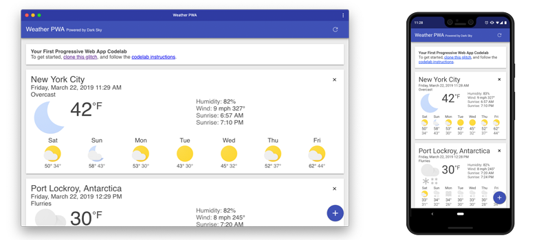
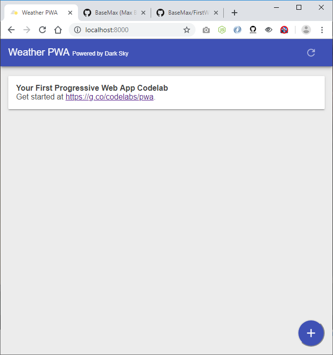
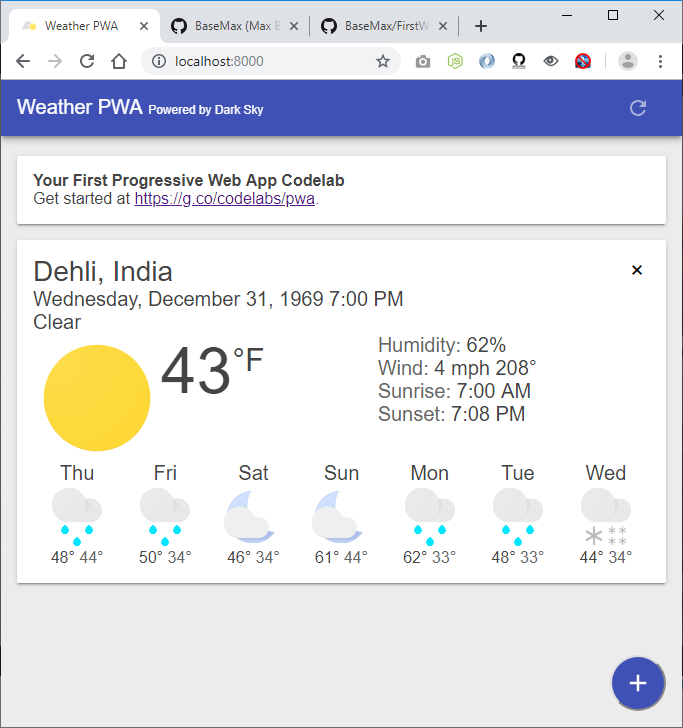
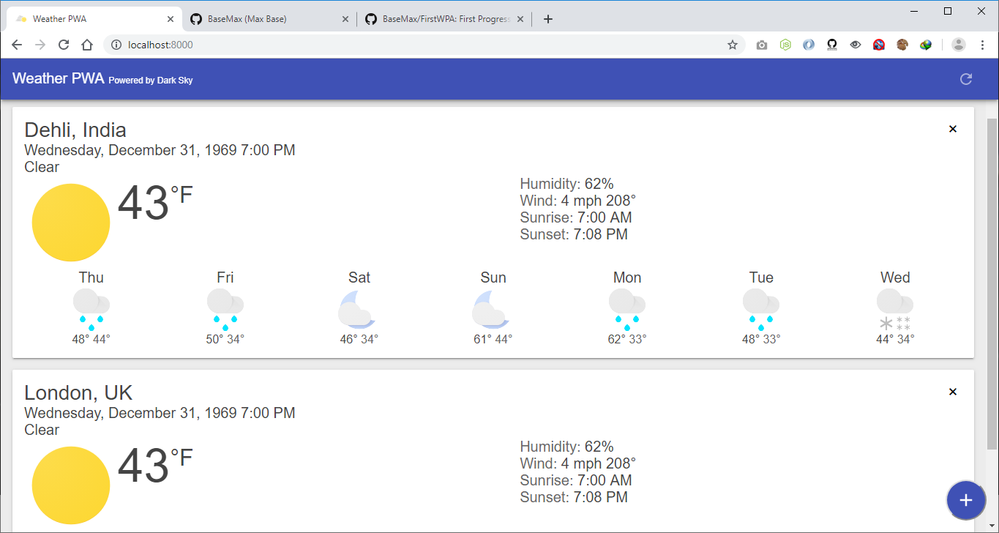
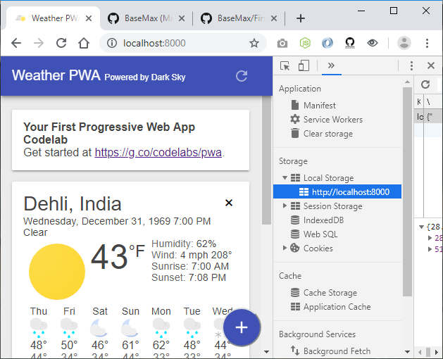
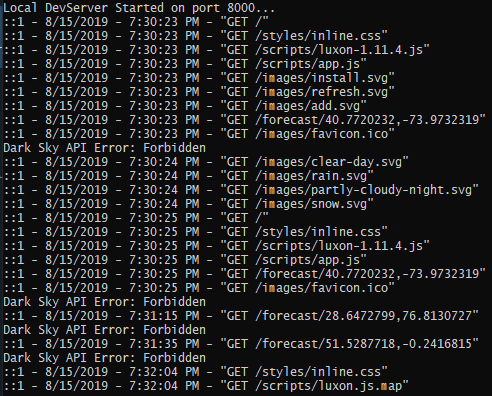

# First Progressive Web App

First Progressive Web App using Nodejs, HTML, CSS, Javascript.



## First PWA


## Using

```
$ git clone https://github.com/BaseMax/FirstPWA
$ cd FirstPWA
$ npm install
$ node server.js
```

### Demo









-----------

### Tutorial Clone

Using [Glitch](https://glitch.com/) is the recommended method for working through this codelab.

- Open a new browser tab and go to https://glitch.com.
- If you don't have an account, you'll need to sign up.
- Click New Project, then Clone from Git Repo.
- Clone https://github.com/googlecodelabs/your-first-pwapp.git and click OK.
- Once the repo has loaded, edit the .env file, and update it with your DarkSky API key.
- Click the Show Live button to see the PWA in action.

### Tutorial Compile

- Unpack the downloaded zip file.
- Run npm install to install the dependencies required to run the server.
- Edit server.js and set your DarkSky API key.
- Run node server.js to start the server on port 8000.
- Open a browser tab to http://localhost:8000



## Related Projects

- https://github.com/freeCodeCamp/devdocs
- https://github.com/angular/angular
- https://github.com/ionic-team/ionic
- https://github.com/GoogleChrome/lighthouse
- https://github.com/quasarframework/quasar
- https://github.com/pubkey/rxdb
- https://github.com/OnsenUI/OnsenUI
- https://github.com/ionic-team/stencil

## References

- https://codelabs.developers.google.com/codelabs/your-first-pwapp/#0
- https://developers.google.com/web/fundamentals/codelabs/your-first-pwapp/
- https://github.com/googlecodelabs/your-first-pwapp
